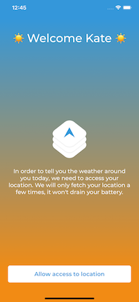
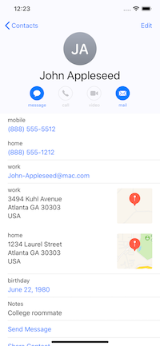

 

# Sunly
☀️ The app that makes the weather friendly

  

## ☀️ About
Sunly is the app to know your best friends weather. It will also tell you where to spend your next week-end 🌴

At the very beginning, I had to build a weather app for getting hired at [Shadow](https://shadow.tech). Of course, I couldn't do just a simple weather app like many others. So, I tried to find real life situation when you need to check the weather. It took me sometimes but I came up with this idea. I talked about it to my friends, many of them where very enthusiatic and proposed me many features to implement so I decided to make it open source and we will see what happens...

Of course, I am still hoping to join the [Shadow](https://shadow.tech) 💻

## 🐍 Architecture
I decided to deal with this app like it could become a big one. So I've used the [VIPER](https://medium.com/@smalam119/viper-design-pattern-for-ios-application-development-7a9703902af6) architectural pattern.
This is a kind of Clean Architecture for iOS applications.

## 🛠 Dependencies
I didn't have enough time to create animation from scratch so I used [Lottie](https://airbnb.design/lottie/) to import existing animation.
I use [CocoaPods](https://cocoapods.org) as dependency manager.

## 🕵️‍♂️ How to test 
### Add some addresses to your contacts
Once approved, the app will retrieve your iPhone contacts with postal addresses. So you need to have some contacts with at least one postal address in your address book. Just like John Appleseed below:

I advice you to do it at least with 5 to 10 contacts. Otherwise test with simulator 😉

### Clone the project

Run `git clone git@github.com:carayolthomas/Sunly.git`

### Install dependencies

Run `pod install`

### Workspace

Open `Sunly.xcworkspace`

Build & Run 🔥

## 🦁 TODO
 - Unit testing
 - UI testing

## 🎁 Licence
This app is released under the [MIT License](https://github.com/carayolthomas/Sunly/blob/master/LICENSE).
